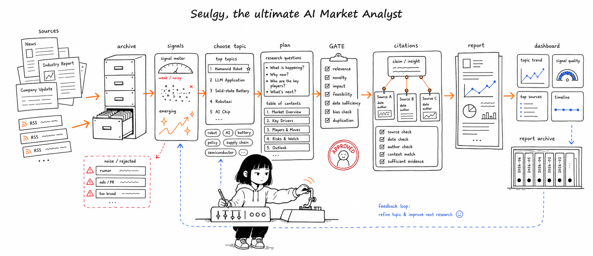

<div align="center">

[English](README.md) · **한국어**

</div>



# Seulgy AI Analyst

<div align="center">

[](https://seulgy.com)
[](LICENSE)
[](https://github.com/Judy-0509/seulgy-ai-analyst/actions/workflows/ci.yml)


[](https://github.com/astral-sh/ruff)


</div>

> 🌐 **seulgy.com에서 실제 운영 중입니다** — 일회성 데모가 아니라 직접 운영하는 제품입니다. 커스텀 도메인 뒤에서 self-host로 돌아가며, Supabase 인증·역할 기반 접근 제어·CI를 갖추고 있습니다. **랜딩·뉴스 피드·보고서 아카이브는 누구나 열람 가능**하고, 보고서 생성과 애널리스트 DB는 로그인 뒤에 있습니다.

Seulgy AI Analyst는 신뢰할 수 있는 리서치 소스를 주제 추천, 근거 기반 분석 계획, 구조화된 애널리스트 보고서로 바꿔주는 AI 기반 마켓 인텔리전스 워크스페이스입니다.

노트북 데모가 아니라 풀스택 제품으로 설계했습니다. FastAPI 백엔드가 리서치 파이프라인을 실행하고, React 인터페이스가 주제 발굴과 보고서 생성을 관리하며, 큐레이션된 소스 아카이브가 시스템을 재사용 가능한 산업 근거에 기반하도록 잡아줍니다 — 그리고 네 개 시장 도메인에 걸쳐 실제 보고서를 서비스하며 프로덕션에서 운영되고 있습니다.

## 라이브 미리보기

<div align="center">


<sub><b>주제 발굴 랜딩</b> — 큐레이션된 산업 소스에서 주간 주제를 자동 랭킹하고, 핵심 주제와 새로 떠오른 주제로 나눠 보여줍니다.</sub>

</div>

<table>
<tr>
<td width="50%" valign="top">
<br/>
<sub><b>마켓 인텔리전스 뉴스 피드</b> — 벤더·이슈·출처 등급으로 필터, 중요도 랭킹과 클러스터링.</sub>
</td>
<td width="50%" valign="top">
<br/>
<sub><b>보고서 아카이브</b> — 도메인별 섹션·인용 수가 표기된 근거 기반 Executive 보고서.</sub>
</td>
</tr>
</table>

<div align="center">

<br/>
<sub>375&nbsp;px까지 대응하는 <b>반응형</b> 공개 페이지.</sub>
</div>

## 이 프로젝트가 돋보이는 이유

- **노트북이 아니라 프로덕션에서 운영**: [seulgy.com](https://seulgy.com)에 멀티스테이지 Docker 이미지, 원커맨드 gitops 롤아웃, Supabase 인증, 역할 기반 접근 제어, GitHub Actions CI로 배포·운영합니다.
- **아카이브 우선 리서치 파이프라인**: 라이브 RSS나 웹 검색으로 넘어가기 전에 큐레이션된 소스 아카이브를 먼저 검색해, 노이즈 인용과 반복 스크래핑을 줄입니다.
- **다단계 애널리스트 워크플로우**: 주제를 리서치 차원으로 분해하고, GATE 체크포인트로 목차를 검증한 뒤, 섹션 단위로 최종 보고서를 작성합니다.
- **휴먼 인 더 루프 제어**: 시스템이 장문 생성을 확정하기 전에 애널리스트가 계획을 승인·수정·확장할 수 있습니다.
- **프로덕션을 염두에 둔 백엔드 설계**: 타입 모델, 비동기 서비스, SSE 스트리밍, 본문 캐싱, 인용 추적, 레이트 리미팅, 토큰 집계, 역할 인식 라우트 — 핵심 영역에 집중한 pytest 커버리지와 함께.

## 라이브 / 프로덕션

이 프로젝트는 일회성 배포가 아니라 실제 제품으로 self-host 운영됩니다:

| 항목 | 방식 |
| --- | --- |
| **호스팅** | 커스텀 도메인 뒤 self-host — [seulgy.com](https://seulgy.com) |
| **패키징** | 멀티스테이지 Docker 빌드: Node가 React 번들을 빌드하고, 이를 슬림한 Python 런타임 이미지에 구워 넣음 |
| **배포** | 원커맨드 gitops 롤아웃 — fast-forward pull → 재빌드 → 헬스체크 게이트 컨테이너 재생성 (빌드 실패 시 이전 컨테이너가 계속 서비스 → 무중단) |
| **인증** | Supabase 인증 (Google OAuth + 이메일) |
| **접근 모델** | 4단계 — **비로그인 → 로그인 → 애널리스트 → 관리자** — 보고서 생성·애널리스트 DB·키워드 편집·피드백 공간을 게이팅 |
| **CI** | 모든 push/PR에서 GitHub Actions — 백엔드(ruff, mypy, pytest), 프론트엔드(eslint, build) |
| **프론트엔드** | 모바일 반응형 공개 페이지, 보고서 타이포그래피, loading / empty / error 상태 분리 |

## 제품 흐름

```text
큐레이션된 소스
  -> 아카이브 빌더
  -> 주제 추천 엔진
  -> 애널리스트 기획 파이프라인
  -> GATE 1 / GATE 2 검토
  -> 근거 기반 보고서
  -> React 대시보드 + 보고서 아카이브
```

## 핵심 기능

| 영역 | 하는 일 |
| --- | --- |
| 주제 발굴 | 아카이브된 산업 소스에서 도메인별로 핵심·신규 시장 주제를 랭킹합니다. |
| 보고서 기획 | 검색 쿼리, 리서치 차원, 목차 후보, 데이터 공백 점검을 생성합니다. |
| 근거 검색 | 아카이브 검색, RSS, DuckDuckGo 폴백에 본문 페치·캐싱·인용 레지스트리를 결합합니다. |
| 보고서 작성 | 섹션 단위 분석으로부터 구조화된 Markdown·HTML 보고서를 생성합니다. |
| 뉴스 인텔리전스 | 벤더·이슈·출처 등급 필터, 중요도 랭킹, 클러스터링으로 마켓 인텔리전스 뉴스를 집계합니다. |
| 접근·역할 | Supabase 인증 기반 4단계 역할 모델, 애널리스트 피드백 워크플로우, 관리자 제어. |
| 애널리스트 UI | 주제 목록, 파이프라인 진행, 아카이브, 보고서, 뉴스, 피드백, 관리자 뷰를 위한 도메인 인식형 React 경험. |

## 도메인과 소스

네 개 시장 도메인을 다룹니다:

- 스마트폰
- 휴머노이드 로보틱스
- 자동차
- 스페이스 데이터센터

`data/archives/` 아래 **66개의 큐레이션된 소스 아카이브**에 기반하며, 각각 전용 빌더 스크립트를 갖습니다. 소스는 시장조사 기관, 투자은행 리서치, 트레이드 프레스, OEM, 1차 피드를 아우릅니다 — 예: Counterpoint, Omdia, TrendForce, IDC, Yole, Gartner, Goldman Sachs, Morgan Stanley, BofA, McKinsey, BCG, Bloomberg, ABI Research, IDTechEx, IFR, IEEE Spectrum, TechCrunch, Boston Dynamics, Figure AI, Unitree, NVIDIA, SpaceNews, Data Center Frontier, JATO, AlixPartners, arXiv.

## 아키텍처

```text
frontend/
  React 19 + Vite 앱
  도메인 인식형 랜딩, 보고서, 뉴스, DB, 키워드, 사용량, 피드백, 로그인 페이지
  Supabase 인증 컨텍스트 + 역할 게이팅 라우트; 모바일 반응형 공개 페이지

src/
  FastAPI 서버 + 비동기 보고서 파이프라인 (상태 머신)
  서비스: LLM, 검색, 인용, 본문 페치 + 캐시, GLM 레이트 리미터, 토큰 로깅
  인증, 역할, 피드백 모듈
  마켓 뉴스 수집(SQLite) + 스케줄러

scripts/
  소스별 아카이브 빌더
  주제 추천 및 리랭킹 유틸리티

data/
  도메인 프롬프트와 키워드 세트
  66개의 큐레이션된 소스 아카이브

tests/
  상태 머신, 검색, 인용, 캐시, 모델, LLM 동작에 집중한 pytest 커버리지
```

## 기술 스택

| 레이어 | 도구 |
| --- | --- |
| 프론트엔드 | React 19, Vite 8, react-router-dom 7 |
| 백엔드 | Python 3.10+, FastAPI, uvicorn, Pydantic |
| AI | 기본 GLM-4.7 Thinking, 선택적 Qwen 호환 백엔드 |
| 검색 | 아카이브 검색, RSS, DuckDuckGo 폴백 |
| 데이터 | JSON 아카이브, SQLite(뉴스 + 본문 캐시), 생성된 Markdown·HTML 보고서 |
| 인증 | Supabase (Google OAuth + 이메일), 4단계 역할 모델 |
| 실시간 | 파이프라인 진행용 Server-Sent Events |
| 배포 | 멀티스테이지 Docker, GitHub Actions CI |
| 품질 | pytest, ruff, mypy, eslint |

## 로컬 실행

### 1. 백엔드 의존성 설치

```bash
pip install -e .
```

### 2. 프론트엔드 의존성 설치

```bash
cd frontend
npm install
cd ..
```

### 3. 환경 변수 설정

```bash
cp .env.example .env
```

GLM에 필요:

```env
LLM_BACKEND=glm
ZHIPU_API_KEY=your_zhipu_api_key_here
```

선택적 Qwen 호환 백엔드:

```env
LLM_BACKEND=qwen
QWEN_API_KEY=your_qwen_api_key_here
QWEN_BASE_URL=https://dashscope.aliyuncs.com/compatible-mode/v1
QWEN_MODEL=qwen3-32b
QWEN_FAST_MODEL=qwen3-8b
```

### 4. 앱 실행

```bash
python start.py
```

주요 경로:

| URL | 용도 |
| --- | --- |
| `http://localhost:5173/` | 주제 발굴 랜딩 페이지 |
| `http://localhost:5173/news` | 마켓 인텔리전스 뉴스 피드 |
| `http://localhost:5173/app` | 보고서 생성 파이프라인 |
| `http://localhost:5173/archive` | 생성된 보고서 아카이브 |
| `http://localhost:8000/dashboard` | 백엔드 아카이브 대시보드 |

## CLI 사용법

검토 체크포인트를 거치는 보고서 생성:

```bash
python run_report.py "분석 주제"
```

자동 모드로 보고서 생성:

```bash
python run_report.py --auto "분석 주제"
```

주제 추천 갱신:

```bash
python run_suggest.py
```

전체 아카이브 재빌드:

```bash
python scripts/build_all_archives.py
```

## 품질 점검

```bash
pytest
```

```bash
cd frontend
npm run lint
```

## 라이선스

[MIT License](LICENSE)로 배포됩니다.
