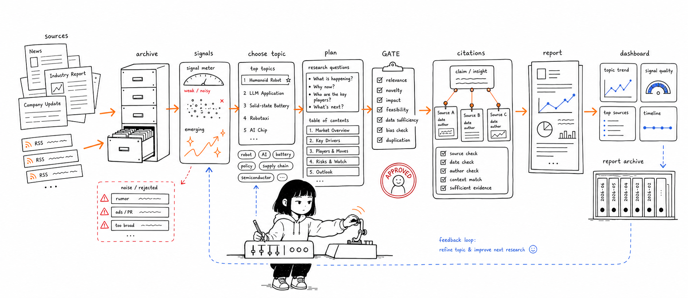

<div align="center">

[English](README.md) · **한국어**

</div>



# Seulgy AI Analyst

<div align="center">

[](LICENSE)


</div>

Seulgy AI Analyst는 신뢰할 수 있는 리서치 소스를 주제 추천, 근거 기반 분석 계획, 구조화된 애널리스트 보고서로 바꿔주는 AI 기반 마켓 인텔리전스 워크스페이스입니다.

노트북 데모가 아니라 풀스택 제품으로 설계했습니다. FastAPI 백엔드가 리서치 파이프라인을 실행하고, React 인터페이스가 주제 발굴과 보고서 생성을 관리하며, 큐레이션된 소스 아카이브가 시스템을 재사용 가능한 산업 근거에 기반하도록 잡아줍니다.

## 이 프로젝트가 돋보이는 이유

- **아카이브 우선 리서치 파이프라인**: 라이브 RSS나 웹 검색으로 넘어가기 전에 큐레이션된 소스 아카이브를 먼저 검색해, 노이즈 인용과 반복 스크래핑을 줄입니다.
- **다단계 애널리스트 워크플로우**: 주제를 리서치 차원으로 분해하고, GATE 체크포인트로 목차를 검증한 뒤, 섹션 단위로 최종 보고서를 작성합니다.
- **휴먼 인 더 루프 제어**: 시스템이 장문 생성을 확정하기 전에 애널리스트가 계획을 승인·수정·확장할 수 있습니다.
- **채용 담당자가 바로 읽을 수 있는 제품 표면**: React 대시보드, 보고서 아카이브, 주제 추천, 키워드 관리, 피드백 워크플로우, 사용량 뷰를 포함합니다.
- **프로덕션을 염두에 둔 백엔드 설계**: 타입 모델, 비동기 서비스, SSE 스트리밍, 본문 캐싱, 인용 추적, 역할 기반 라우트, 핵심 영역에 집중한 pytest 커버리지를 사용합니다.

## 제품 흐름

```text
큐레이션된 소스
  -> 아카이브 빌더
  -> 주제 추천 엔진
  -> 애널리스트 기획 파이프라인
  -> GATE 1 / GATE 2 검토
  -> 근거 기반 보고서
  -> React 대시보드 + 보고서 아카이브
```

## 핵심 기능

| 영역 | 하는 일 |
| --- | --- |
| 주제 발굴 | 아카이브된 산업 소스에서 떠오르는 시장 주제를 랭킹합니다. |
| 보고서 기획 | 검색 쿼리, 리서치 차원, 목차 후보, 데이터 공백 점검을 생성합니다. |
| 근거 검색 | 아카이브 검색, RSS, DuckDuckGo 폴백, 본문 페치, 캐싱, 인용 레지스트리 로직을 결합합니다. |
| 보고서 작성 | 섹션 단위 분석으로부터 구조화된 Markdown·HTML 보고서를 생성합니다. |
| 애널리스트 UI | 주제 목록, 파이프라인 진행, 아카이브, 보고서, 피드백, 관리자 뷰를 위한 도메인 인식형 React 경험을 제공합니다. |

## 도메인과 소스

현재 레포지토리는 다음 도메인 설정을 포함합니다:

- 스마트폰
- 휴머노이드 로보틱스
- 자동차
- 스페이스 데이터센터

또한 `data/archives/` 아래에 **66개의 소스 아카이브**가 있으며, 각각 전용 빌더 스크립트를 갖습니다. 소스는 시장조사 기관, 투자은행 리서치, 트레이드 프레스, OEM, 1차 피드를 아우릅니다 — 예: Counterpoint, Omdia, TrendForce, IDC, Yole, Gartner, Goldman Sachs, Morgan Stanley, BofA, McKinsey, BCG, Bloomberg, ABI Research, IDTechEx, IFR, IEEE Spectrum, TechCrunch, Boston Dynamics, Figure AI, Unitree, NVIDIA, SpaceNews, Data Center Frontier, JATO, AlixPartners, arXiv.

## 아키텍처

```text
frontend/
  React 19 + Vite 앱
  도메인 인식형 랜딩, 보고서, DB, 키워드, 사용량, 피드백, 로그인 페이지

src/
  FastAPI 서버
  비동기 보고서 파이프라인
  LLM, 검색, 인용, 번역, 본문 페치, 인증, 역할, 피드백 서비스

scripts/
  소스별 아카이브 빌더
  주제 추천 및 리랭킹 유틸리티

data/
  도메인 프롬프트와 키워드 세트
  큐레이션된 소스 아카이브

tests/
  상태 머신, 검색, 인용, 캐시, 모델, LLM 동작에 집중한 pytest 커버리지
```

## 기술 스택

| 레이어 | 도구 |
| --- | --- |
| 프론트엔드 | React 19, Vite 8, react-router-dom 7 |
| 백엔드 | Python 3.10+, FastAPI, uvicorn, Pydantic |
| AI | 기본 GLM-4.7 Thinking, 선택적 Qwen 호환 백엔드 |
| 검색 | 아카이브 검색, RSS, DuckDuckGo 폴백 |
| 데이터 | JSON 아카이브, SQLite 본문 캐시, 생성된 Markdown·HTML 보고서 |
| 실시간 | 파이프라인 진행용 Server-Sent Events |
| 품질 | pytest, eslint |

## 빠른 시작

### 1. 백엔드 의존성 설치

```bash
pip install -e .
```

### 2. 프론트엔드 의존성 설치

```bash
cd frontend
npm install
cd ..
```

### 3. 환경 변수 설정

```bash
cp .env.example .env
```

GLM에 필요:

```env
LLM_BACKEND=glm
ZHIPU_API_KEY=your_zhipu_api_key_here
```

선택적 Qwen 호환 백엔드:

```env
LLM_BACKEND=qwen
QWEN_API_KEY=your_qwen_api_key_here
QWEN_BASE_URL=https://dashscope.aliyuncs.com/compatible-mode/v1
QWEN_MODEL=qwen3-32b
QWEN_FAST_MODEL=qwen3-8b
```

### 4. 앱 실행

```bash
python start.py
```

주요 경로:

| URL | 용도 |
| --- | --- |
| `http://localhost:5173/` | 주제 발굴 랜딩 페이지 |
| `http://localhost:5173/app` | 보고서 생성 파이프라인 |
| `http://localhost:5173/db` | 아카이브·리서치 데이터베이스 뷰 |
| `http://localhost:5173/reports` | 생성된 보고서 아카이브 |
| `http://localhost:8000/dashboard` | 백엔드 아카이브 대시보드 |

## CLI 사용법

검토 체크포인트를 거치는 보고서 생성:

```bash
python run_report.py "분석 주제"
```

자동 모드로 보고서 생성:

```bash
python run_report.py --auto "분석 주제"
```

주제 추천 갱신:

```bash
python run_suggest.py
```

전체 아카이브 재빌드:

```bash
python scripts/build_all_archives.py
```

## 품질 점검

```bash
pytest
```

```bash
cd frontend
npm run lint
```

## 라이선스

[MIT License](LICENSE)로 배포됩니다.

## 레포지토리 노트

예전 작업 제목은 `Research Helper`였습니다. 포트폴리오·채용 맥락에서는 **Seulgy AI Analyst**가 더 강한 프로젝트 이름입니다 — 읽기 쉽고, 개인적이며, 애널리스트를 위한 AI 제품임을 즉시 전달합니다.
