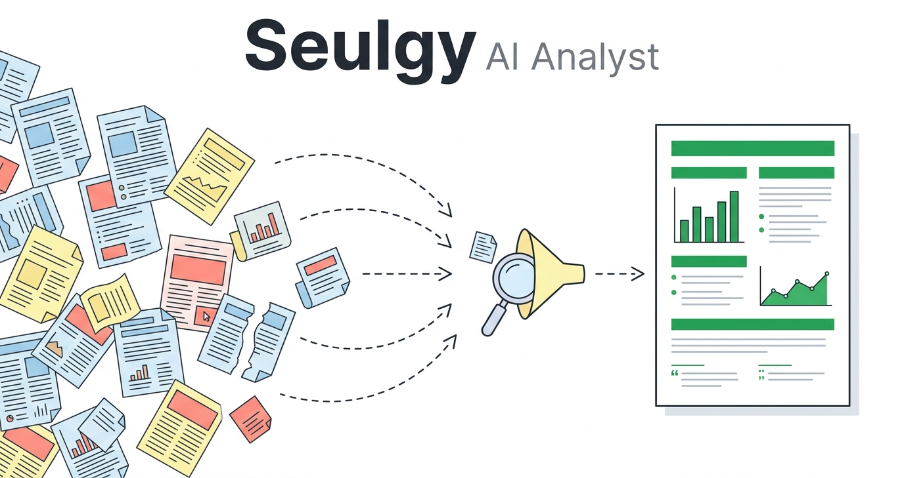
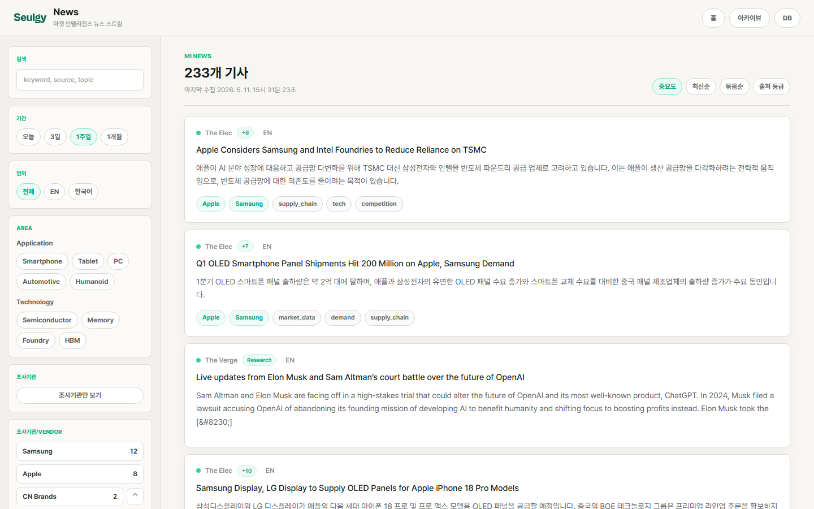
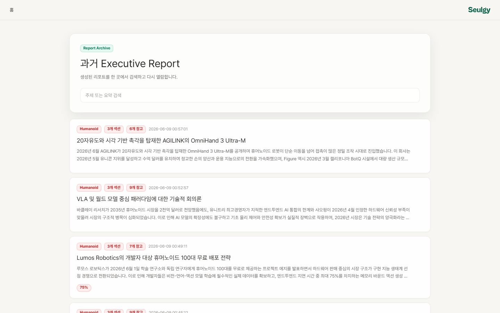
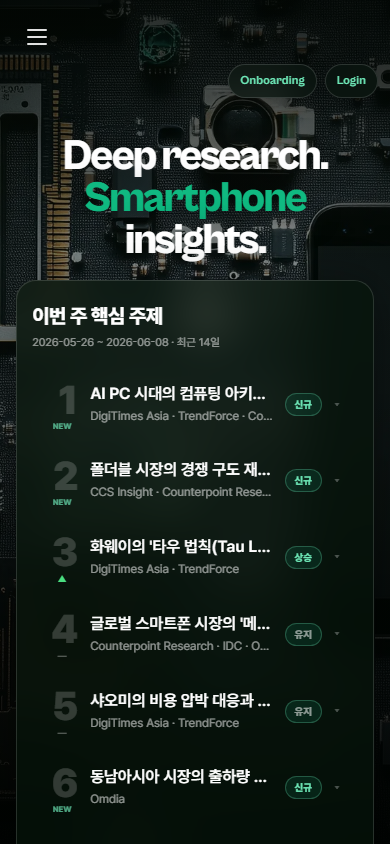

<div align="center">

**English** · [한국어](README.ko.md)

</div>



<div align="center">

[](https://seulgy.com)
[](https://github.com/Judy-0509/seulgy-ai-analyst/actions/workflows/ci.yml)
[](LICENSE)


</div>

> 🌐 **Live in production at [seulgy.com](https://seulgy.com)** — this is a real, self-operated product, not a throwaway demo. It runs self-hosted behind a custom domain with Supabase authentication, role-based access, and continuous integration. The **landing, news feed, and report archive are publicly browsable**; report generation and the analyst database sit behind login.

Seulgy AI Analyst is an AI-powered market-intelligence workspace that turns trusted research sources into topic recommendations, evidence-backed analysis plans, and structured analyst reports.

It was built as a full-stack product, not a notebook demo: a FastAPI backend runs the research pipeline, a React interface manages topic discovery and report generation, and curated source archives keep the system grounded in reusable industry evidence — and it actually runs in production, serving real reports across four market domains.

## Why I Built This

I'm a market-intelligence analyst. Tracking a market means reading everything — broker notes, research-firm data, trade press — and every week the reading list outgrew the hours available. Worse, the whole process depended on one person having a quiet week. Seulgy is my answer: a system that monitors curated sources, surfaces what changed, and drafts the report — while the analyst stays in the loop to approve, reshape, or reject the plan before a single section is written. It doesn't replace the analyst. It frees the analyst to think.

## Live Preview

> 🔗 Click any screenshot to open that page live on **[seulgy.com](https://seulgy.com)**.

<div align="center">

<a href="https://seulgy.com/"></a>

<sub><b>Topic discovery landing</b> — weekly topics auto-ranked from curated industry sources, split into major themes and emerging picks.</sub>

</div>

<table>
<tr>
<td width="50%" valign="top">
<a href="https://seulgy.com/news"></a><br/>
<sub><b>Market-intelligence news feed</b> — filter by vendor, issue, source tier; importance-ranked and clustered.</sub>
</td>
<td width="50%" valign="top">
<a href="https://seulgy.com/archive"></a><br/>
<sub><b>Report archive</b> — evidence-backed executive reports with section and citation counts per domain.</sub>
</td>
</tr>
</table>

<div align="center">
<a href="https://seulgy.com/"></a>
<br/>
<sub><b>Responsive</b> public pages, down to 375&nbsp;px.</sub>
</div>

## Why This Project Stands Out

- **Runs in production, not just on a laptop**: deployed and operated at [seulgy.com](https://seulgy.com) with a multi-stage Docker image, a one-command gitops rollout, Supabase auth, role-based access, and GitHub Actions CI.
- **Archive-first research pipeline**: searches a curated source archive before falling back to live RSS or web search, reducing noisy citations and repeated scraping.
- **Multi-step analyst workflow**: decomposes a topic into research dimensions, validates the table of contents through GATE checkpoints, then writes the final report section by section.
- **Human-in-the-loop controls**: lets an analyst approve, revise, or extend plans before the system commits to long-form generation.
- **Production-minded backend design**: typed models, async services, SSE streaming, body caching, citation tracking, rate limiting, token accounting, and role-aware routes — with focused pytest coverage.

## Live / Production

The project is self-hosted and operated as a real product, not a one-off deploy:

| Concern | Approach |
| --- | --- |
| **Hosting** | Self-hosted behind a custom domain — [seulgy.com](https://seulgy.com) |
| **Packaging** | Multi-stage Docker build: Node builds the React bundle, which is baked into a slim Python runtime image |
| **Deploy** | One-command gitops rollout — fast-forward pull → rebuild → health-gated container recreate (the previous container keeps serving if a build fails, so a bad build means no downtime) |
| **Auth** | Supabase authentication (Google OAuth + email) |
| **Access model** | Four tiers — **visitor → member → analyst → admin** — gating report generation, the analyst database, keyword editing, and the feedback workspace |
| **CI** | GitHub Actions on every push/PR — backend (ruff, mypy, pytest) and frontend (eslint, build) |
| **Frontend** | Mobile-responsive public pages, server-rendered report typography, and graceful loading / empty / error states |

## Product Flow

```text
Curated sources
  -> archive builders
  -> topic suggestion engine
  -> analyst planning pipeline
  -> GATE 1 / GATE 2 review
  -> evidence-backed report
  -> React dashboard + report archive
```

## Core Capabilities

| Area | What it does |
| --- | --- |
| Topic discovery | Ranks major and emerging market topics from archived industry sources, per domain. |
| Report planning | Generates search queries, research dimensions, TOC candidates, and data-gap checks. |
| Evidence retrieval | Combines archive search, RSS, and DuckDuckGo fallback with body fetching, caching, and a citation registry. |
| Report writing | Produces structured Markdown and HTML reports from section-level analysis. |
| News intelligence | Aggregates market-intelligence news with vendor / issue / source-tier filters, importance ranking, and clustering. |
| Access & roles | Supabase auth with a four-tier role model, an analyst feedback workflow, and admin controls. |
| Analyst UI | A domain-aware React experience for topic lists, pipeline progress, archives, reports, news, feedback, and admin views. |

## Domains And Sources

The system covers four market domains:

- Smartphone
- Humanoid robotics
- Automotive
- Space datacenter

It is grounded in **66 curated source archives** under `data/archives/`, each with a dedicated builder script. Sources span market-research firms, investment-bank research, trade press, OEMs, and primary feeds — for example Counterpoint, Omdia, TrendForce, IDC, Yole, Gartner, Goldman Sachs, Morgan Stanley, BofA, McKinsey, BCG, Bloomberg, ABI Research, IDTechEx, IFR, IEEE Spectrum, TechCrunch, Boston Dynamics, Figure AI, Unitree, NVIDIA, SpaceNews, Data Center Frontier, JATO, AlixPartners, and arXiv.

> 📦 The archive **contents** are built locally by those builder scripts and are **not committed** to this repo — only the builders and domain configs are. A fresh clone starts with empty archives; run `python scripts/build_all_archives.py` to populate them.

## Architecture

```text
frontend/
  React 19 + Vite app
  domain-aware landing, reports, news, DB, keywords, usage, feedback, and login pages
  Supabase auth context + role-gated routes; mobile-responsive public pages

src/
  FastAPI server + async report pipeline (state machine)
  services: LLM, search, citation, body fetching + cache, GLM rate limiter, token logging
  auth, roles, and feedback modules
  market-news ingestion (SQLite) + scheduler

scripts/
  source-specific archive builders
  topic suggestion and reranking utilities

data/
  domain prompts and keyword sets
  66 curated source archives

tests/
  focused pytest coverage for state machine, search, citations, cache, models, and LLM behavior
```

## Tech Stack

| Layer | Tools |
| --- | --- |
| Frontend | React 19, Vite 8, react-router-dom 7 |
| Backend | Python 3.10+, FastAPI, uvicorn, Pydantic |
| AI | GLM-4.7 Thinking by default, optional Qwen-compatible backend |
| Search | Archive search, RSS, DuckDuckGo fallback |
| Data | JSON archives, SQLite (news + body cache), generated Markdown/HTML reports |
| Auth | Supabase (Google OAuth + email), four-tier role model |
| Realtime | Server-Sent Events for pipeline progress |
| Delivery | Multi-stage Docker, GitHub Actions CI |
| Quality | pytest, ruff, mypy, eslint |

## Run It Locally

### 1. Install backend dependencies

```bash
pip install -e .
```

### 2. Install frontend dependencies

```bash
cd frontend
npm install
cd ..
```

### 3. Configure environment variables

```bash
cp .env.example .env
```

Required for GLM:

```env
LLM_BACKEND=glm
ZHIPU_API_KEY=your_zhipu_api_key_here
```

Optional Qwen-compatible backend:

```env
LLM_BACKEND=qwen
QWEN_API_KEY=your_qwen_api_key_here
QWEN_BASE_URL=https://dashscope.aliyuncs.com/compatible-mode/v1
QWEN_MODEL=qwen3-32b
QWEN_FAST_MODEL=qwen3-8b
```

### 4. Run the app

```bash
python start.py
```

Useful routes:

| URL | Purpose |
| --- | --- |
| `http://localhost:5173/` | Topic discovery landing page |
| `http://localhost:5173/news` | Market-intelligence news feed |
| `http://localhost:5173/app` | Report-generation pipeline |
| `http://localhost:5173/archive` | Generated report archive |
| `http://localhost:8000/dashboard` | Backend archive dashboard |

## CLI Usage

Generate a report with review checkpoints:

```bash
python run_report.py "analysis topic"
```

Generate a report in automatic mode:

```bash
python run_report.py --auto "analysis topic"
```

Refresh topic suggestions:

```bash
python run_suggest.py
```

Rebuild all archives:

```bash
python scripts/build_all_archives.py
```

## Quality Checks

```bash
pytest
```

```bash
cd frontend
npm run lint
```

## License

Released under the [MIT License](LICENSE).
