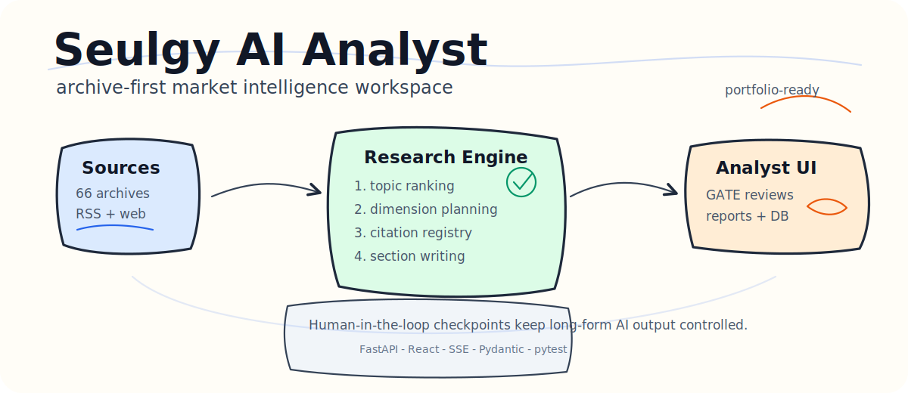

# Seulgy AI Analyst



Seulgy AI Analyst is an AI-powered market intelligence workspace that turns trusted research sources into topic recommendations, evidence-backed analysis plans, and structured analyst reports.

It was built as a full-stack product, not a notebook demo: a FastAPI backend runs the research pipeline, a React interface manages topic discovery and report generation, and source archives keep the system grounded in reusable industry evidence.

## Why This Project Stands Out

- **Archive-first research pipeline**: searches a curated source archive before falling back to live RSS or web search, reducing noisy citations and repeated scraping.
- **Multi-step analyst workflow**: decomposes a topic into research dimensions, validates the table of contents through GATE checkpoints, then writes the final report section by section.
- **Human-in-the-loop controls**: lets an analyst approve, revise, or extend plans before the system commits to long-form generation.
- **Recruiter-readable product surface**: includes a React dashboard, report archive, topic suggestions, keyword management, feedback workflows, and usage views.
- **Production-minded backend design**: uses typed models, async services, SSE streaming, body caching, citation tracking, role-aware routes, and focused pytest coverage.

## Product Flow

```text
Curated sources
  -> archive builders
  -> topic suggestion engine
  -> analyst planning pipeline
  -> GATE 1 / GATE 2 review
  -> evidence-backed report
  -> React dashboard + report archive
```

## Core Capabilities

| Area | What it does |
| --- | --- |
| Topic discovery | Ranks emerging market topics from archived industry sources. |
| Report planning | Generates search queries, research dimensions, TOC candidates, and data-gap checks. |
| Evidence retrieval | Combines archive search, RSS, DuckDuckGo fallback, body fetching, caching, and citation registry logic. |
| Report writing | Produces structured Markdown and HTML reports from section-level analysis. |
| Analyst UI | Provides a domain-aware React experience for topic lists, pipeline progress, archives, reports, feedback, and admin views. |

## Domains And Sources

The repository currently includes domain configuration for:

- Smartphone
- Humanoid robotics
- Automotive
- Space datacenter

It also includes **66 archive JSON files** under `data/archives/`, with builders for sources such as Counterpoint, Omdia, TrendForce, IDC, Gartner, Reuters, McKinsey, Morgan Stanley, Yole, ABI Research, IEEE Spectrum, TechCrunch, and more.

## Architecture

```text
frontend/
  React 19 + Vite app
  domain-aware landing, reports, DB, keywords, usage, feedback, and login pages

src/
  FastAPI server
  async report pipeline
  LLM, search, citation, translation, body-fetching, auth, roles, and feedback services

scripts/
  source-specific archive builders
  topic suggestion and reranking utilities

data/
  domain prompts and keyword sets
  curated source archives

tests/
  focused pytest coverage for state machine, search, citations, cache, models, and LLM behavior
```

## Tech Stack

| Layer | Tools |
| --- | --- |
| Frontend | React 19, Vite, react-router-dom |
| Backend | Python 3.10+, FastAPI, uvicorn, Pydantic |
| AI | GLM-4.7 Thinking by default, optional Qwen-compatible backend |
| Search | Archive search, RSS, DuckDuckGo fallback |
| Data | JSON archives, SQLite body cache, generated Markdown/HTML reports |
| Realtime | Server-Sent Events for pipeline progress |
| Quality | pytest, eslint |

## Quick Start

### 1. Install backend dependencies

```bash
pip install -e .
```

### 2. Install frontend dependencies

```bash
cd frontend
npm install
cd ..
```

### 3. Configure environment variables

```bash
cp .env.example .env
```

Required for GLM:

```env
LLM_BACKEND=glm
ZHIPU_API_KEY=your_zhipu_api_key_here
```

Optional Qwen-compatible backend:

```env
LLM_BACKEND=qwen
QWEN_API_KEY=your_qwen_api_key_here
QWEN_BASE_URL=https://dashscope.aliyuncs.com/compatible-mode/v1
QWEN_MODEL=qwen3-32b
QWEN_FAST_MODEL=qwen3-8b
```

### 4. Run the app

```bash
python start.py
```

Useful routes:

| URL | Purpose |
| --- | --- |
| `http://localhost:5173/` | Topic discovery landing page |
| `http://localhost:5173/app` | Report-generation pipeline |
| `http://localhost:5173/db` | Archive and research database view |
| `http://localhost:5173/reports` | Generated report archive |
| `http://localhost:8000/dashboard` | Backend archive dashboard |

## CLI Usage

Generate a report with review checkpoints:

```bash
python run_report.py "analysis topic"
```

Generate a report in automatic mode:

```bash
python run_report.py --auto "analysis topic"
```

Refresh topic suggestions:

```bash
python run_suggest.py
```

Rebuild all archives:

```bash
python scripts/build_all_archives.py
```

## Quality Checks

```bash
pytest
```

```bash
cd frontend
npm run lint
```

## Repository Note

The old working title was `Research Helper`. For a portfolio or recruiting context, **Seulgy AI Analyst** is the stronger project name: it is readable, personal, and immediately communicates that this is an analyst-facing AI product.
